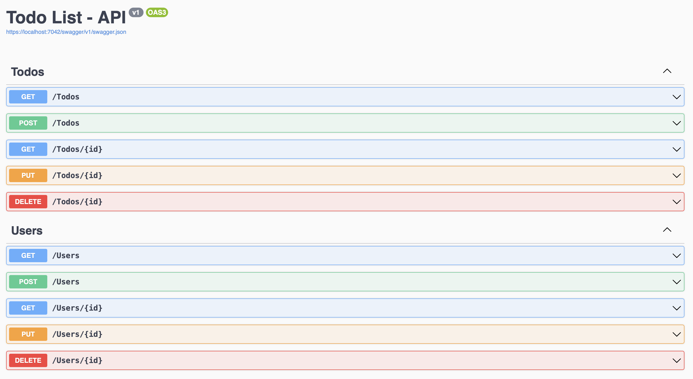
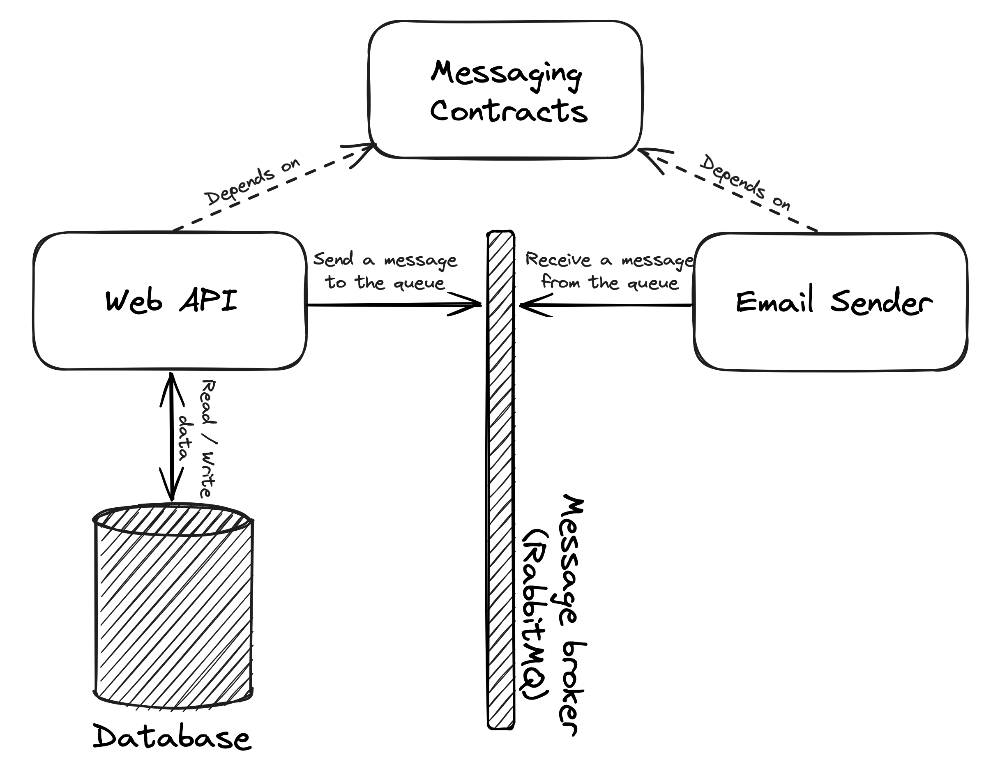

<div align="center">

  
  
  
  
  
  [](https://github.com/MrKonstantinSh/TodoList-Messaging/blob/main/LICENSE)

</div>

<br />
<div align="center">
  <a href="https://github.com/MrKonstantinSh/OpenScreen">
    
  </a>

  <h3 align="center">TodoList-Messaging</h3>

  <div align="center">
    Web API created to work with RabbitMQ and MassTransit using a simple To Do list as an example.
    <br />    
    <br />
    <a href="https://github.com/MrKonstantinSh/TodoList-Messaging/issues">Report Bug</a>
  </div>
</div>


## Table of Contents

* [About the Project](#about-the-project)
  * [Technologies and Tools](#technologies-and-tools)
  * [Features](#features)
* [Getting Started](#getting-started)
  * [Installation and Setup](#installation-and-setup)
  * [System Description](#system-description)
  * [Tests](#tests)
* [Contributing](#contributing)
* [License](#license)
* [Contact](#contact)


## About The Project
**TodoList-Messaging** is a Web API created as an example, the main purpose of which is to learn and see how to work with message-brokers (RabbitMQ) and MassTransit framework on the .NET platform.

### Features
* CRUD operations on the 'User' entity
* CRUD operations on the 'Todo' entity
* Sending an email notification when the status of a 'Todo' entity changes

The available endpoints can be viewed at link http://{HOST:PORT}/swagger/index.html after the project has been started  in 'Development' mode:



### Technologies and Tools
* [.NET 7](https://dotnet.microsoft.com/en-us/download/dotnet/7.0)
* [Postgres](https://www.postgresql.org)
* [Entity Framework Core](https://learn.microsoft.com/en-gb/ef/)
* [RabbitMQ](https://www.rabbitmq.com)
* [MassTransit](https://masstransit.io)
* [MediatR](https://github.com/jbogard/MediatR)
* [FluentValidation](https://docs.fluentvalidation.net/en/latest/index.html)
* [AutoMapper](https://automapper.org)
* [xUnit](https://xunit.net)
* [NSubstitute](https://nsubstitute.github.io)
* [FluentAssertions](https://fluentassertions.com)
* [Rider](https://www.jetbrains.com/rider/)
* [Docker](https://www.docker.com)


<!-- GETTING STARTED -->
## Getting Started

### Installation and Setup
1. Clone the repository
```sh
> git clone https://github.com/MrKonstantinSh/TodoList-Messaging.git
```

2. Go to the project folder
```sh
> cd ./ProjectFolder
```

3. Create and start docker containers
```sh
> docker compose up
```

4. Apply migrations 
```sh
> dotnet ef database update -p src/TodoList.WebApi/TodoList.WebApi.csproj -s src/TodoList.WebApi/TodoList.WebApi.csproj --connection 'Host={HOST};Database=todos;Username={USERNAME};Password={PASSWORD}'
```

### System Description

<p align="center">Diagram of interaction of system elements</p>

**TodoList.WebApi** - Web API that provides the ability to perform CRUD operations on User and Todo entities. When a Todo entity's status changes, it sends a message to the message broker ([RabbitMQ](https://www.rabbitmq.com)) using the [MassTransit](https://masstransit.io) framework.

**TodoList.EmailSender** - A service that retrieves messages from a message broker ([RabbitMQ](https://www.rabbitmq.com)) using the [MassTransit](https://masstransit.io) framework. And performs email distribution based on the content received from the message.

**TodoList.MessagingContracts** - Contains the contracts of messages sent (received) to (from) the message broker.

### Tests
The core functionality of Web Api is covered by unit tests. To run the tests you need to execute the following command:
```sh
> dotnet test 
```


## Contributing

Contributions are what make the open source community such an amazing place to be learn, inspire, and create. Any contributions you make are greatly appreciated.

1. Fork the Project
2. Create your Feature Branch (`git checkout -b feature/AmazingFeature`)
3. Commit your Changes (`git commit -m 'Add some AmazingFeature'`)
4. Push to the Branch (`git push origin feature/AmazingFeature`)
5. Open a Pull Request


## License

Distributed under the MIT License. See [LICENSE](https://github.com/MrKonstantinSh/TodoList-Messaging/blob/main/LICENSE) for more information.


<!-- CONTACT -->
## Contact

Konstantin Shulga - mrkonstantinsh@gmail.com

Project Link: [https://github.com/MrKonstantinSh/TodoList-Messaging](https://github.com/MrKonstantinSh/TodoList-Messaging)
